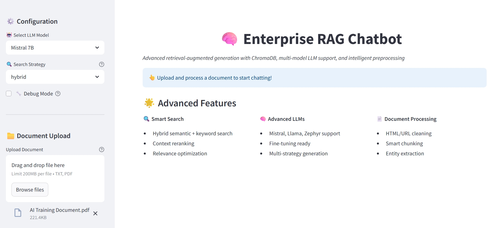
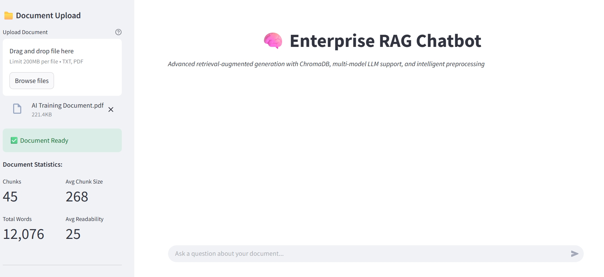
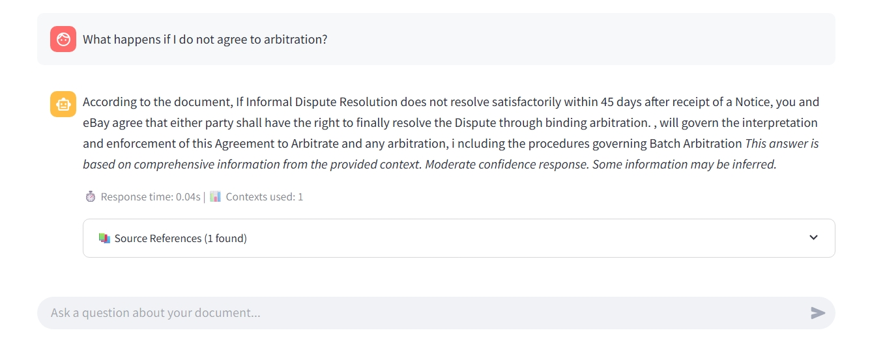

# Enterprise RAG Chatbot

A sophisticated Retrieval-Augmented Generation (RAG) chatbot built with cutting-edge technologies for enterprise-grade document analysis and question-answering.


## 🎥 Demo Video

[

## 📸 Screenshots

### 🏠 Home Page




### Chat Interface

.



## 🌟 Key Features

### Advanced Document Processing
- **Multi-format Support**: PDF and text file processing with intelligent text extraction
- **Smart Preprocessing**: HTML/URL removal, noise cleaning, and text normalization
- **Intelligent Chunking**: Semantic-aware document segmentation with sentence boundary detection
- **Entity Recognition**: Automatic extraction of key entities, numbers, and dates
- **Readability Analysis**: Content quality scoring for optimal chunk selection

### State-of-the-Art Retrieval
- **Hybrid Search**: Combines semantic similarity and keyword matching for optimal relevance
- **ChromaDB Integration**: Persistent vector storage with advanced indexing
- **Context Reranking**: Multi-factor relevance scoring for improved results
- **Dynamic Optimization**: Automatic context selection and length optimization

### Multi-Model LLM Support
- **Llama 2**: Meta's powerful 7B parameter model for comprehensive responses
- **Mistral 7B**: Efficient and accurate instruction-tuned model
- **Zephyr 7B**: Fine-tuned conversational AI with strong reasoning capabilities
- **Phi-2**: Microsoft's compact yet powerful language model
- **Fallback Systems**: Robust error handling with graceful degradation

### Enterprise Features
- **Performance Monitoring**: Real-time metrics and response time tracking
- **Debug Mode**: Comprehensive debugging information for system optimization
- **Data Export**: Full conversation and knowledge base export capabilities
- **Scalable Architecture**: Modular design supporting easy model swapping
- **Security First**: Local processing with optional cloud integration

## 🚀 Quick Start

### Prerequisites

```bash
Python 3.11+
4GB+ RAM recommended
CUDA-compatible GPU (optional, for faster inference)
```

### Installation

1. **Clone the repository**
```bash
git clone https://github.com/your-org/enterprise-rag-chatbot.git
cd enterprise-rag-chatbot
```

2. **Install dependencies**
```bash
pip install -r requirements.txt
```

3. **Run the application**
```bash
streamlit run src/app.py --server.port 5000
```

4. **Access the interface**
```
Open your browser to http://localhost:5000
```

## 📋 System Requirements

### Minimum Requirements
- **CPU**: 4 cores, 2.0 GHz+
- **RAM**: 8GB
- **Storage**: 2GB free space
- **Python**: 3.11 or higher

### Recommended Requirements
- **CPU**: 8 cores, 3.0 GHz+
- **RAM**: 16GB+
- **GPU**: NVIDIA GPU with 8GB+ VRAM
- **Storage**: 10GB free space (for model caching)

## 🏗️ Architecture Overview

```
┌─────────────────────────────────────────────────────────────┐
│                    Streamlit Web Interface                  │
├─────────────────────────────────────────────────────────────┤
│                Enhanced RAG Pipeline                        │
├─────────────┬─────────────────────┬─────────────────────────┤
│ Document    │   Vector Store      │    LLM Handler         │
│ Processor   │   (ChromaDB)        │   (Multi-Model)        │
│             │                     │                         │
│ • PDF/TXT   │ • Embeddings        │ • Llama/Mistral        │
│ • HTML Clean│ • Similarity        │ • Streaming            │
│ • Chunking  │ • Hybrid Search     │ • Fine-tuning Ready    │
│ • Metadata  │ • Persistence       │ • Fallback Systems     │  
└─────────────┴─────────────────────┴─────────────────────────┘
```

### Core Components

1. **Enhanced Document Processor** (`src/components/enhanced_document_processor.py`)
   - Advanced text preprocessing with HTML/URL cleaning
   - Smart semantic chunking with overlap optimization
   - Comprehensive metadata extraction including entities and readability scores

2. **Enhanced Vector Store** (`src/components/enhanced_vector_store.py`)
   - ChromaDB integration with persistent storage
   - Hybrid search capabilities (semantic + keyword)
   - Multiple embedding model support with fallbacks

3. **Advanced LLM Handler** (`src/components/advanced_llm_handler.py`)
   - Multi-model support (Llama, Mistral, Zephyr, Phi-2)
   - Fine-tuning capabilities and prompt optimization
   - Streaming responses with fallback generation

4. **Enhanced RAG Pipeline** (`src/components/enhanced_rag_pipeline.py`)
   - Complete RAG workflow orchestration
   - Context reranking and optimization
   - Performance monitoring and debug capabilities

5. **Text Preprocessor** (`src/utils/text_preprocessor.py`)
   - Advanced text cleaning and normalization
   - URL/HTML removal and noise reduction
   - Statistical analysis and preprocessing metrics

## 🔧 Configuration

### Model Configuration

Edit `src/components/advanced_llm_handler.py` to customize model settings:

```python
model_configs = {
    "llama-7b": {
        "hf_name": "meta-llama/Llama-2-7b-chat-hf",
        "context_length": 4096,
        "system_prompt": "Custom system prompt..."
    },
    # Add your custom models here
}
```

### Vector Store Settings

Modify `src/components/enhanced_vector_store.py` for ChromaDB configuration:

```python
# Custom collection settings
collection = client.get_or_create_collection(
    name="your_collection_name",
    metadata={"hnsw:space": "cosine"}  # or "l2", "ip"
)
```

### Search Parameters

Adjust search behavior in `src/components/enhanced_rag_pipeline.py`:

```python
# Retrieval settings
top_k = 5  # Number of chunks to retrieve
similarity_threshold = 0.3  # Minimum similarity score
search_weights = {
    'semantic': 0.7,  # Semantic search weight
    'keyword': 0.3    # Keyword search weight
}
```

## 📊 Performance Optimization

### Memory Management
- **Chunk Size**: Optimal range 200-400 words
- **Overlap**: 10-25% of chunk size
- **Context Window**: Balance between relevance and token limits

### GPU Acceleration
- Enable CUDA for transformer models
- Use mixed precision (FP16) for memory efficiency
- Consider model quantization for resource-constrained environments

### Caching Strategy
- Embedding models cached with `@st.cache_resource`
- Vector indices persisted to disk
- Response caching for repeated queries

## 🧪 Testing & Validation

### Unit Tests
```bash
python -m pytest tests/unit/
```

### Integration Tests
```bash
python -m pytest tests/integration/
```

### Performance Benchmarks
```bash
python scripts/benchmark.py --model mistral-7b --dataset eval_dataset.json
```

## 📈 Monitoring & Analytics

### Built-in Metrics
- Response time tracking
- Context relevance scoring
- Query success rates
- Model performance statistics

### Export Capabilities
- Conversation history export
- Knowledge base snapshots
- Performance metrics CSV export
- Debug logs and system diagnostics

## 🔒 Security & Privacy

### Data Protection
- Local processing by default
- No data sent to external APIs without explicit consent
- Secure vector storage with optional encryption
- User session isolation and cleanup

### Model Security
- Sandboxed model execution
- Input validation and sanitization
- Rate limiting and resource controls
- Audit logging for enterprise compliance

## 🚀 Deployment Options

### Local Development
```bash
streamlit run src/app.py --server.port 5000
```

### Docker Deployment
```bash
docker build -t rag-chatbot .
docker run -p 5000:5000 rag-chatbot
```

### Cloud Deployment
- AWS EC2/ECS with GPU support
- Google Cloud Run with custom containers
- Azure Container Instances
- Kubernetes with horizontal scaling

## 📝 API Documentation

### REST API Endpoints (Optional)
```python
POST /api/upload     # Document upload
POST /api/query      # Question answering
GET  /api/stats      # System statistics
POST /api/export     # Data export
```

### Python SDK Usage
```python
from src.components import EnhancedRAGPipeline

# Initialize pipeline
pipeline = EnhancedRAGPipeline(
    vector_store=vector_store,
    llm_handler=llm_handler
)

# Process query
response = pipeline.get_response(
    query="What is the main topic?",
    search_strategy="hybrid"
)
```

## 🤝 Contributing

We welcome contributions! Please see our [Contributing Guidelines](CONTRIBUTING.md) for details.

### Development Setup
```bash
git clone https://github.com/your-org/enterprise-rag-chatbot.git
cd enterprise-rag-chatbot
pip install -e ".[dev]"
pre-commit install
```

### Code Quality
- Black code formatting
- Pylint static analysis
- Type hints with mypy
- Comprehensive test coverage

## 📄 License

This project is licensed under the MIT License - see the [LICENSE](LICENSE) file for details.

## 🙏 Acknowledgments

- **Streamlit** for the amazing web framework
- **ChromaDB** for vector database capabilities
- **Hugging Face** for transformer models and infrastructure
- **Meta AI** and **Mistral AI** for open-source language models

## 📞 Support

### Documentation
- [User Guide](docs/user_guide.md)
- [Developer Documentation](docs/developer_guide.md)
- [API Reference](docs/api_reference.md)
- [Troubleshooting](docs/troubleshooting.md)

### Community
- **GitHub Issues**: Bug reports and feature requests
- **Discussions**: Community support and Q&A
- **Wiki**: Extended documentation and tutorials

### Commercial Support
For enterprise support, custom development, and deployment assistance, contact our team.

---

**Built with ❤️ for the enterprise AI community**

*Last updated: January 2025*
